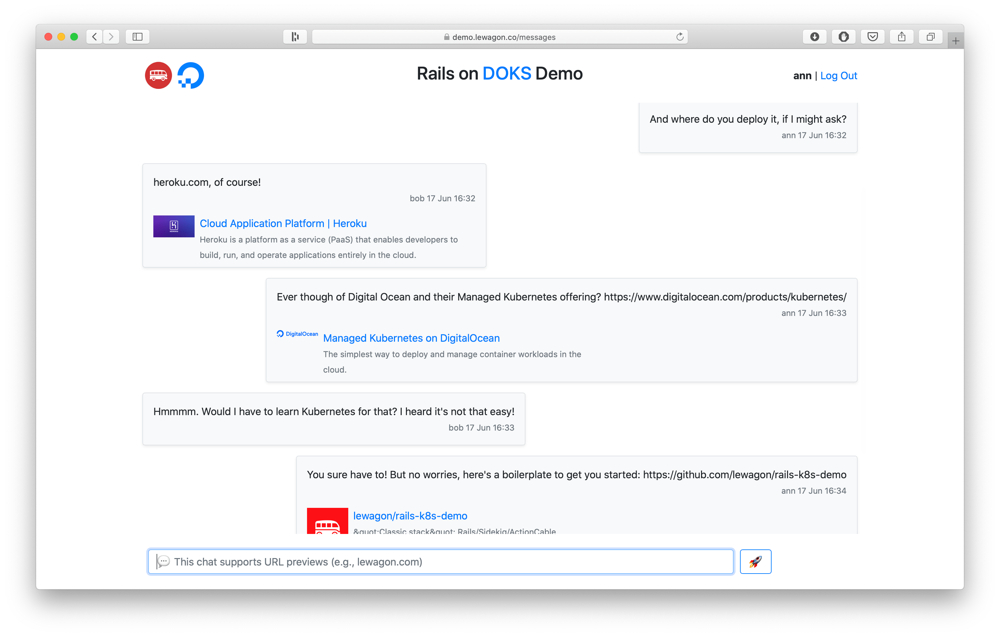
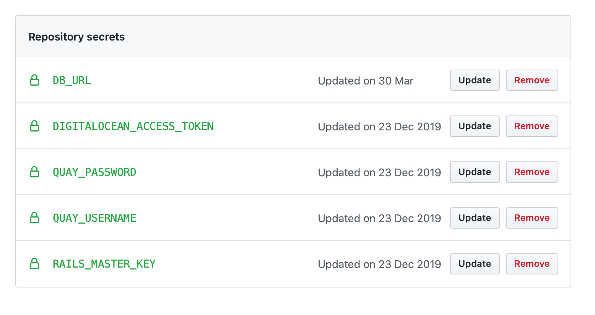

# Le Wagon x Digital Ocean Rails-on-Kubernetes demo

:construction: This setup is a work in progress :construction:

An attempt at creating a standardized Docker/Kubernetes-Helm/GitHub Actions setup for use with Rails projects.
A version of this setup (that is little bit further ahead) is now used in production for services available to [Le Wagon](https://www.lewagon.com) teachers, students, and alumni.

## Demo application

A standard Action Cable chat application (Rails 6 + Stimulus) that uses [twitter-text](https://github.com/twitter/twitter-text/tree/master/rb) gem to extract free-formed URLs out of text and generate Open Graph previews for links. The dependency was chosen consciously, as it requires an external system library to function (`libidn11`), which makes it a perfect case for Docker.

It requires Sidekiq, Redis, and PostgreSQL to run, which represents the standard deployment stack of production Rails apps.

## Goals

- Create a sensible approach to running fairly complex Rails projects in development with Docker
- Generate reproducible and customizable configuration
- Store everything related to deployments in the same repo as application code. Rely on GitHub one-way encrtypred secrets to store sensitive data like database connection strings.
- Cater to a _"classic Rails stack"_: Rails, Puma, Sidekiq, Redis, PostgreSQL, Webpacker, Action Cable
- Allow for only a certain amount of complexity: enough to fit inside a head of a single full-stack developer who may end up maintaining the projects.
- Hide ugly details of Kubernetes management by relying on **1 environment/1 cluster** approach and letting Digital Ocean manage the master node.
- Deploy with `git push origin master` or a PR merge on GitHub
- Use any external Postgres database
- Provide the easy migration from "Heroku way of doing things", once the application is past the MVP and needs to scale for a reasonable cost.

## Current status

By constantly migrating legacy applications to this setup and starting new ones with the same setup in mind we make sure that all common production bugs will be squashed before we can _fully automate_ the generation of charts and configuration.

## Running locally

We use [dip](https://github.com/bibendi/dip) by Misha Merkushin at [Evil Martians](https://evilmartians.com) to achieve a "classic CLI" feel while working with Docker under the hood.

- `dip provision` to build all necessary images and setup the local DB
- `dip up -d` to run all services in the background: `app`, `rails`, `sidekiq`, `webpacker` (runs `webpack-dev-server` for JS live reload), `postgres`, `redis`. Go to `localhost:3000` :tada:
- `dip rails c` to visit console.
- `dip down` to stop the music and go home.

If you need to change project dependencies—run `dip bundle` and/or `dip yarn` after any changes to `Gemfile` or `package.json`.

Check out `dip.yml` for other common shortcuts.

Alternatively, you can launch `dip rails s`, `dip sidekiq`, and `dip webpacker` in respective tabs. This will allow for easier debugging with `byebug` (no need to attach to running Docker processes).

## Running in production

- Provision a cluster from [Digital Ocean Managed Kubernetes](https://www.digitalocean.com/products/kubernetes/), install Nginx Ingress Controller, create DNS A record, set up [jetstack/certmanager](https://cert-manager.io/docs/installation/kubernetes/#installing-with-helm) for SSL. _Expect futher explanation of those steps once the setup is out of internal testing._
- Install Helm 3 on your machine. Run `make upgrade-dev` from project repo to deploy the release into the cluster.
- Once you verified that the deployment from local machine works — feel free to fork the repo and set up the following secrets:

:warning: You don't have to use Quay as Docker image backend, in that case you can alter `Makefile` push commands to your own image hosting provider.

- After you're done—a push to master will trigger a GitHub Action for deployment. See `deploy.yaml` for details.

**:pray: Suggestions and PRs are welcome!**
